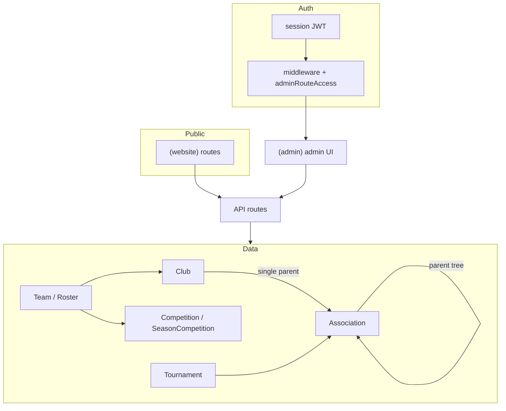

# Platform architecture (high level)

Multi-level hockey operations: **associations** (tree), **clubs**, **teams/rosters**, **season competitions**, **tournaments**, and **public** surfaces.

## Entity relationships

## Request paths

| Layer | Responsibility |
|--------|----------------|
| **`app/(website)/`** | Public marketing, clubs directory, competition views (read-mostly). |
| **`app/(admin)/admin/`** | Authenticated admin UI; shell layout in `app/(admin)/layout.tsx`. |
| **`middleware.ts`** | Cookie session, public allowlist, then **`evaluateAdminRouteAccess`** for `/admin` and `/portal` prefixes. |
| **`lib/auth/adminRouteAccess.ts`** | Single source for **which roles** may hit which **URL prefixes** (tested in Vitest). |
| **`lib/types/roles.ts`** | **`ROLE_DEFINITIONS`** and **`Permission`** — authoritative for **`requirePermission`** on APIs. |
| **`app/api/admin/*`** | Mutations must validate org scope (association/club) from session + resource, not from client trust alone. |

## Related docs

- `docs/domain/CANONICAL_GRAPH.md` — hierarchy rules.
- `docs/domain/ROLE_MATRIX.md` — roles, personas, enforcement layers.
- `docs/domain/OWNERSHIP_MIGRATIONS.md` — club/association moves.
- `docs/domain/MULTI_CLUB_AND_TRANSFERS.md` — multi-club membership, transfers, fee authority (A5).
- `docs/platform/FEATURE_FLAGS.md` — opt-out toggles for risky league/tournament fixture operations (Epic K5).
- `docs/platform/NOTIFICATIONS.md`, `PAYMENTS.md`, `COMPLIANCE_AND_OPS.md` — Epic J (email, payments mode, export/ops).

**Edge middleware:** unauthenticated users are redirected to login; **forbidden** `/api/*` responses use **403 JSON** (not an HTML redirect) so clients can handle errors cleanly.
